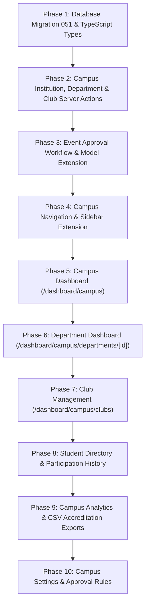

# URPASS Campus — Existing Feature Audit & Architecture Specification

**Document Version:** 1.0.0  
**Target Milestone:** URPASS Campus Organizational Layer  
**Date:** September 2026  
**Guiding Principle:** **Reusability First.** Do not rebuild features that already exist. Build strictly the missing campus organizational layer on top of the established URPASS foundation.

---

## 1. Executive Summary

URPASS already possesses a production-grade, enterprise-ready event management, pass issuance, atomic check-in, and analytics engine. **URPASS Campus** is not a separate application; it is an **institutional and hierarchical multi-tenant layer** that organizes events, teams, and attendees under academic entities:

```
Institution (e.g., ABC Engineering College)
  ├── Academic Years (e.g., 2026-27, 2027-28)
  ├── Departments (e.g., Computer Science, ECE, Mechanical)
  │     ├── Clubs & Societies (e.g., Coding Club, Robotics Club)
  │     ├── Cells & Committees (e.g., Symposium Committee)
  │     └── Organizers & Faculty Coordinators
  ├── Institution-Level Units (e.g., Placement Cell, Cultural Committee, Sports Committee)
  ├── Student Directory (Roll numbers, departments, years, sections)
  └── Campus Events (Linked to Institution, Department, and/or Club)
```

Existing non-campus events and users on **Free, Starter, Pro, Business, Lifetime, and Event Pass** plans will continue to function completely untouched.

---

## 2. Audit of Existing URPASS Systems (21 Core Capabilities)

The table below catalogs every existing subsystem identified in the URPASS codebase and details its reuse for URPASS Campus.

| # | Subsystem | Existing Database Model | Existing Server Actions & APIs | Existing Components & Libs | Reuse Strategy for Campus |
|---|---|---|---|---|---|
| **1** | **Events** | `events` (migrations `001`, `015`, `041`) | `app/actions/events.ts`<br>`/api/v1/events/` | `components/event/*`<br>`app/dashboard/events/*` | **100% Reused.** Add optional `institution_id`, `department_id`, `club_id`, `academic_year` columns to `events`. Non-campus events keep these columns `NULL`. |
| **2** | **Registration Forms** | `events.application_enabled`, `events.auto_approve` | `app/actions/events.ts`<br>`/api/register/route.ts` | `components/landing/EventRegisterForm.tsx`<br>`app/apply/[eventId]/page.tsx` | **100% Reused.** Public event registration form at `/apply/[applySlug]` supports both internal students and external visitors. |
| **3** | **Custom Registration Fields** | `events.custom_fields` (JSONB schema) | `app/actions/events.ts` | `components/event/EventCustomFieldsBuilder.tsx` | **100% Reused.** Custom fields handle college-specific questions (e.g., Roll No, Year, Section, Food Preference) without schema migrations. |
| **4** | **Attendees** | `attendees` (migrations `001`, `043`) | `app/actions/attendees.ts` | `components/event/AttendeeTable.tsx`<br>`components/event/AddAttendeeModal.tsx` | **100% Reused.** Attendees table stores participant records. For campus events, student records are matched by email or roll number to the Student Directory. |
| **5** | **Attendee Approval** | `attendees.status` (`registered`, `approved`, `rejected`, `waitlisted`) | `approveAttendee`, `rejectAttendee`, `bulkApproveAttendees` | `components/event/AttendeeApprovalActions.tsx` | **100% Reused.** Department and club organizers approve or reject participants individually or in bulk. |
| **6** | **Ticket / Pass Generation** | `passes` (migrations `001`, `036`, `041`) | `app/actions/passes.ts`<br>`/api/pass/image/[passToken]` | `components/pass/PassQR.tsx`<br>`app/pass/[token]/page.tsx` | **100% Reused.** Cryptographic digital QR entry passes generated automatically upon registration or approval. |
| **7** | **Ticket Studio** | `passes.custom_design`, `organization_settings.default_pass_template` | `app/actions/ticket-studio.ts`<br>`app/actions/ticket-design.ts`<br>`/api/studio/*` | `components/studio/*`<br>`app/studio/*`<br>`lib/pass-design.ts` | **100% Reused.** Visual drag-and-drop designer for symposium ID badges, fest entry passes, and custom club credentials. |
| **8** | **QR Check-In** | `passes`, `checkins` (migration `043`) | `app/actions/manual-checkin.ts`<br>`/api/verify` | `app/scan/[eventId]/page.tsx`<br>`lib/scanner-feedback.ts` | **100% Reused.** Mobile camera check-in (<0.3s) with audio chimes and haptics. Student volunteers check in attendees directly on their phones. |
| **9** | **Duplicate Scan Prevention** | `atomic_checkin_pass` procedure (migration `043`) | Postgres row-lock transaction | `lib/capacity-reservation.ts`<br>`lib/scanner-feedback.ts` | **100% Reused.** Sub-50ms atomic check prevents screenshot sharing and duplicate entries across all campus gates. |
| **10** | **Multi-Gate Scanning** | `scanner_gates` (migrations `018`, `041`, `043`) | `app/actions/scanner-gates.ts` | `components/scan/*`<br>`components/event/GateBreakdownChart.tsx` | **100% Reused.** Multiple campus entrances (Main Gate, Auditorium, North Gate, Food Court) monitored in real time. |
| **11** | **Attendance Tracking** | `passes.checked_in_at`, `checkins` | `app/actions/analytics.ts` | Supabase Realtime channel `event-checkins` | **100% Reused.** Instant attendance velocity, check-in percentages, and time-stamped attendance records. |
| **12** | **Analytics** | Raw attendee/check-in aggregations | `app/actions/analytics.ts` (`getEventAnalytics`, `getCrossEventAnalytics`) | `components/analytics/*`<br>`app/dashboard/analytics/*` | **100% Reused & Aggregated.** Existing analytics engine powers Campus-wide, Department-wide, and Club-wide rollups. |
| **13** | **CSV Import & Export** | Client-side & server-side streaming | `bulkAddAttendees`, `exportAttendeesCSV` in `app/actions/attendees.ts` | `components/event/AttendeeTable.tsx` | **100% Reused.** Extended to support Student Directory bulk roster import and institutional accreditation reporting exports. |
| **14** | **Organizer & Team Accounts** | `organizations`, `organization_members` (`015`, `041`) | `app/actions/organizations.ts`<br>`app/actions/org-members.ts` | `components/org/*`<br>`app/dashboard/organizations/*` | **100% Reused.** Extended with campus-specific role scopes (Institution Admin, Department Admin, Club Admin, Organizer, Scanner). |
| **15** | **Team Permissions** | `organization_members.role`, `workspace_members.role` | `get_user_org_role`, `is_org_member` | `lib/validations/organization.ts`<br>`components/org/RoleSelector.tsx` | **100% Reused.** Role hierarchy enforced via Postgres RLS and server action authorization checks. |
| **16** | **Email Notifications** | Resend API integration, transactional templates | `lib/email.ts`<br>`app/actions/communications.ts` | `app/api/notifications/*` | **100% Reused.** Pass dispatch emails, approval notices, schedule change alerts, and campus-wide communications. |
| **17** | **Paid Events** | `events.is_paid_event`, `ticket_types` (`017`) | `app/actions/ticket-types.ts`<br>`/api/razorpay/ticket-order` | `components/event/TicketTypeManager.tsx` | **100% Reused.** College fests can sell paid delegate passes, workshop tickets, and cultural entries. |
| **18** | **Razorpay Gateway** | `org_payment_settings`, Razorpay orders | `lib/razorpay.ts`<br>`/api/razorpay/*`<br>`/api/webhook/razorpay` | `components/billing/*` | **100% Reused.** Direct UPI and net banking settlement with 0% platform fee directly into the institution's or department's bank account. |
| **19** | **API Access** | `api_keys` (`009`, `041`) | `app/actions/api-keys.ts`<br>`lib/api-auth.ts`<br>`/api/v1/*` | `app/dashboard/api-keys/*`<br>`app/dashboard/developer/*` | **100% Reused.** College ERP systems (SAP, CampusTechnology, Contineo) can sync student registration data via REST API. |
| **20** | **Webhooks** | `webhook_endpoints`, `webhook_deliveries` (`020`, `041`) | `app/actions/webhooks.ts`<br>`lib/webhooks.ts` | `app/dashboard/developer/*` | **100% Reused.** Real-time event triggers (`attendee.registered`, `pass.checked_in`) dispatched to campus servers. |
| **21** | **Custom Domains** | `custom_domains`, `organization_settings.custom_domain` (`046`) | `app/actions/custom-domains.ts`<br>`app/actions/domains.ts` | Middleware hostname router | **100% Reused.** Institutions can host event portals on subdomains (e.g. `events.college.edu` or `fest.psgtech.ac.in`). |

---

## 3. Classification of Requested Campus Features

Below is the classification of all 15 Campus features requested in the prompt:

| # | Campus Feature | Status | Existing Foundation | What is Reused | What Needs to be Built |
|---|---|---|---|---|---|
| **1** | **Institution Entity** | **PARTIAL** | `organizations`, `organization_settings` (`015`, `041`) | Tenant isolation, slug generation, logo handling, branding settings, admin user references | New `institutions` table with code, domain, academic year, status, and primary admin linking |
| **2** | **Campus Hierarchy** | **PARTIAL** | `workspaces`, `workspace_members` (`041`) | Workspace concept, member role mappings, parent-child references | `campus_departments` and `campus_clubs` tables with department-to-club and institution-level unit relationships |
| **3** | **Campus Roles** | **PARTIAL** | `organization_members.role`, `workspace_members.role` | Existing role verification, member invitation workflow, user profile linking | Campus role mapping: `INSTITUTION_ADMIN`, `DEPARTMENT_ADMIN`, `CLUB_ADMIN`, `ORGANIZER`, `SCANNER` |
| **4** | **Event Ownership** | **PARTIAL** | `events` (`001`, `041`) | Complete event lifecycle, dates, venues, limits, ticketing, scanner gates | Optional foreign keys on `events`: `institution_id`, `department_id`, `club_id`, `academic_year` |
| **5** | **Campus Event Approval** | **PARTIAL** | `events.status` (`draft`, `active`), `attendees` approval | Event state management, status toggles, notification dispatch | Workflow states: `draft` -> `pending_approval` -> `approved` / `rejected` / `changes_requested`, plus institution toggle |
| **6** | **Campus Dashboard** | **MISSING** | `app/actions/analytics.ts`, `app/actions/events.ts` | Analytics calculation queries, event summary cards, time-series data | New route `/dashboard/campus` with campus overview cards, upcoming events, top departments, trends |
| **7** | **Department Dashboard** | **MISSING** | `workspaces`, `analytics` | Department-level event and member listings | New route `/dashboard/campus/departments/[departmentId]` with department stats, clubs, and organizers |
| **8** | **Club Management** | **MISSING** | `workspaces`, `organization_members` | CRUD patterns, modal forms, member assignments | New route `/dashboard/campus/clubs` with create/edit club, department assignment, admin role linking |
| **9** | **Academic Year** | **MISSING** | Event dates, date filters | Date parsing, event date comparisons | `academic_year` field, institution active academic year selector, analytics year filter |
| **10** | **Student Directory** | **MISSING** | `attendees` table, CSV bulk import/export | CSV parser, table layout, search & filter components | `campus_students` table (roll number, department, year, section), CSV import/export, student-attendee linker |
| **11** | **Student Participation History** | **MISSING** | `attendees`, `passes`, `checkins` | Check-in records, attendance timestamps, event details | Student profile view with registered/attended/missed metrics and event participation timeline |
| **12** | **Institution Analytics** | **PARTIAL** | `app/actions/analytics.ts` | Core aggregation algorithms, attendance rates, velocity metrics | Multi-level filtering by academic year, department, club; department comparison charts; NAAC/NIRF CSV export |
| **13** | **Campus Navigation** | **PARTIAL** | `components/dashboard/Sidebar.tsx`, `AppShell.tsx` | Sidebar structure, active state styling, mobile navigation | Conditional "Campus" sidebar block shown only to users belonging to an institution |
| **14** | **Campus Settings** | **MISSING** | `organization-settings.ts`, `components/org/` | Setting update actions, logo upload, color pickers | Route `/dashboard/campus/settings` for institution metadata, academic years, approval toggle, branding |
| **15** | **Compatibility & Non-Interference** | **AVAILABLE** | `lib/plan.ts`, plan entitlements | Subscription gating, database constraints, fallback plans | Strict isolation: normal organizers and existing plans (`Free`, `Starter`, `Pro`, `Business`, `Lifetime`) remain untouched |

---

## 4. Deep-Dive Feature Analysis

### Feature 1: Institution Entity
- **Status:** **PARTIAL**
- **Existing File / Component:** `app/actions/organizations.ts`, `lib/validations/organization.ts`, `components/org/OrganizationSettingsForm.tsx`
- **Existing API:** `/api/scim/v2/[orgId]`, `/api/v1/events`
- **Existing Database Model:** `public.organizations` (id, name, slug, logo_url, website, contact_email, brand_color, created_by), `public.organization_settings` (timezone, currency, allowed_domains, require_approval_for_passes, custom_domain, brand_logo_url, brand_primary_color)
- **What Can Be Reused:**
  - Supabase authentication (`auth.users`) — no separate login or registration system needed.
  - Slug generation and collision handling in `app/actions/organizations.ts`.
  - Organization settings table for branding and custom domains.
- **What Needs Modification / Creation:**
  - Create table `public.institutions` (or link to `organizations`):
    - `id` (UUID PK)
    - `organization_id` (UUID references `organizations(id)` on delete cascade — enables 100% reuse of all enterprise org tooling)
    - `name` (TEXT)
    - `institution_code` (TEXT UNIQUE, e.g. `ABCENG`, `IITM`)
    - `logo_url` (TEXT)
    - `website` (TEXT)
    - `email_domain` (TEXT, e.g. `college.edu`)
    - `address` (TEXT)
    - `current_academic_year` (TEXT, default `'2026-27'`)
    - `primary_admin_id` (UUID references `auth.users(id)`)
    - `subscription_tier` (TEXT default `'campus'`)
    - `require_event_approval` (BOOLEAN default `true`)
    - `status` (TEXT check in `active`, `pending`, `suspended`)
    - `created_at`, `updated_at`
  - Action: `app/actions/campus/institution.ts` (`getInstitution`, `updateInstitution`, `createInstitution`).

---

### Feature 2: Campus Hierarchy (Institution -> Departments -> Clubs / Cells)
- **Status:** **PARTIAL**
- **Existing File / Component:** `app/actions/workspaces.ts`, `lib/validations/workspace.ts`
- **Existing Database Model:** `public.workspaces`, `public.workspace_members`
- **What Can Be Reused:**
  - Multi-team partition concept from Migration 041.
  - Color badges, slug validation, and description fields.
- **What Needs Modification / Creation:**
  - Create `public.campus_departments`:
    - `id` (UUID PK), `institution_id` (UUID FK), `name` (TEXT), `code` (TEXT, e.g. `CSE`, `ECE`, `MECH`), `slug` (TEXT), `description` (TEXT), `head_of_department_id` (UUID FK auth.users), `color` (TEXT), `created_at`, `updated_at`.
  - Create `public.campus_clubs`:
    - `id` (UUID PK), `institution_id` (UUID FK), `department_id` (UUID FK nullable — null represents institution-wide units like Placement Cell, Cultural Committee, Sports Committee, Alumni Cell, Entrepreneurship Cell), `name` (TEXT), `slug` (TEXT), `category` (TEXT check in `'department_club'`, `'cell'`, `'committee'`, `'student_chapter'`, `'society'`), `faculty_advisor_id` (UUID FK auth.users), `lead_student_id` (UUID FK auth.users), `color` (TEXT), `created_at`, `updated_at`.
  - Actions: `app/actions/campus/departments.ts`, `app/actions/campus/clubs.ts`.

---

### Feature 3: Campus Roles & Permissions
- **Status:** **PARTIAL**
- **Existing File / Component:** `app/actions/org-members.ts`, `components/org/OrgMemberList.tsx`, `components/org/RoleSelector.tsx`
- **Existing Database Model:** `public.organization_members` (`role check in 'owner', 'admin', 'event_manager', 'checkin_staff', 'viewer', 'member'`), `public.workspace_members`
- **What Can Be Reused:**
  - Member invitation system with secure tokens and auto-join on signup.
  - User identity resolution via Supabase Auth and `profiles` table.
- **What Needs Modification / Creation:**
  - Create `public.campus_members`:
    - `id` (UUID PK), `institution_id` (UUID FK), `user_id` (UUID FK auth.users), `department_id` (UUID FK nullable), `club_id` (UUID FK nullable), `role` (TEXT check in `'INSTITUTION_ADMIN'`, `'DEPARTMENT_ADMIN'`, `'CLUB_ADMIN'`, `'ORGANIZER'`, `'SCANNER'`), `invited_email` (TEXT), `status` (TEXT check in `'active'`, `'pending'`), `created_at`, `updated_at`.
  - Hierarchy Enforcement:
    - `INSTITUTION_ADMIN`: Full access to all events, departments, clubs, analytics, approvals, settings.
    - `DEPARTMENT_ADMIN`: Access to events and clubs belonging to their specific `department_id`.
    - `CLUB_ADMIN`: Access to events belonging to their specific `club_id`.
    - `ORGANIZER`: Creates and edits assigned events within their department/club.
    - `SCANNER`: Check-in access only via `/scan/[eventId]`.

---

### Feature 4: Event Ownership (Extend Event Model)
- **Status:** **PARTIAL**
- **Existing File / Component:** `app/actions/events.ts`, `lib/validations/event.ts`, `types/index.ts`
- **Existing Database Model:** `public.events` (has `organization_id`, `workspace_id`, `location_id`)
- **What Can Be Reused:**
  - 100% of the existing event creation, scheduling, venue management, ticketing, and check-in workflows.
- **What Needs Modification / Creation:**
  - Add optional nullable columns to `public.events`:
    - `institution_id` (UUID references `institutions(id)` on delete set null)
    - `department_id` (UUID references `campus_departments(id)` on delete set null)
    - `club_id` (UUID references `campus_clubs(id)` on delete set null)
    - `academic_year` (TEXT, e.g. `'2026-27'`)
  - Update `lib/validations/event.ts` and `types/index.ts` to include these optional fields.
  - Non-campus events leave these fields `null`. Zero impact on non-campus users.

---

### Feature 5: Campus Event Approval Workflow
- **Status:** **PARTIAL**
- **Existing File / Component:** `app/actions/events.ts`, `app/actions/attendees.ts`, `components/event/EventHeader.tsx`
- **Existing Database Model:** `public.events.status` (`draft`, `active`, `ended`, `cancelled`)
- **What Can Be Reused:**
  - Status-based UI badges and conditional action buttons.
  - Notification dispatch via `lib/email.ts` and `app/actions/in-app-notifications.ts`.
- **What Needs Modification / Creation:**
  - Add columns to `public.events`:
    - `approval_status` (TEXT default `'not_required'` check in `'not_required'`, `'draft'`, `'pending_approval'`, `'approved'`, `'rejected'`, `'changes_requested'`)
    - `rejection_reason` (TEXT)
    - `submitted_for_approval_at` (TIMESTAMPTZ)
    - `reviewed_by` (UUID references auth.users)
    - `reviewed_at` (TIMESTAMPTZ)
  - Workflow Actions in `app/actions/campus/event-approval.ts`:
    - `submitEventForApproval(eventId)`
    - `approveCampusEvent(eventId)`
    - `rejectCampusEvent(eventId, reason)`
    - `requestChangesCampusEvent(eventId, feedback)`
  - Institution setting toggle: If `require_event_approval` is disabled, events bypass review and publish directly.

---

### Feature 6: Campus Dashboard (`/dashboard/campus`)
- **Status:** **MISSING**
- **Existing File / Component:** `app/dashboard/DashboardContent.tsx`, `components/dashboard/*`, `app/actions/analytics.ts`
- **Existing API:** `getCrossEventAnalytics` in `app/actions/analytics.ts`
- **Existing Database Model:** `events`, `attendees`, `passes`, `checkins`
- **What Can Be Reused:**
  - UI metric card patterns, gradient styling, date formatting, and icon sets.
  - Aggregation queries for registrations and checked-in attendees.
- **What Needs Modification / Creation:**
  - Create `app/dashboard/campus/page.tsx` and `app/dashboard/campus/CampusDashboardContent.tsx`.
  - Overview KPI Cards:
    1. **Total Events**
    2. **Upcoming Events**
    3. **Total Registrations**
    4. **Total Attendees**
    5. **Overall Attendance %**
    6. **Active Departments**
    7. **Active Clubs**
  - Section Widgets:
    - Upcoming campus events & Recent events carousel/table
    - Top performing departments by registrations and attendance
    - Registration trends chart & Attendance trends timeline
  - Filter: Global Academic Year selector.

---

### Feature 7: Department Dashboard (`/dashboard/campus/departments/[departmentId]`)
- **Status:** **MISSING**
- **Existing File / Component:** `app/dashboard/events/page.tsx`, `components/event/*`
- **Existing Database Model:** `events`, `attendees`, `checkins`
- **What Can Be Reused:**
  - Event lists, status badges, attendee counts, and date filters.
- **What Needs Modification / Creation:**
  - Create route `app/dashboard/campus/departments/[departmentId]/page.tsx`.
  - Header: Department name, code, HOD name, contact email, assigned clubs count, active events count.
  - KPI Tiles: Events this academic year, Total registrations, Total check-ins, Average attendance %.
  - Tabs:
    - **Events:** All department events with approval statuses and quick actions.
    - **Clubs:** Clubs under this department (e.g. Coding Club, AI Club).
    - **Faculty & Organizers:** Assigned Department Admins and Organizers.
    - **Department Analytics:** Attendance velocity and registration charts.

---

### Feature 8: Club Management (`/dashboard/campus/clubs`)
- **Status:** **MISSING**
- **Existing File / Component:** `components/org/OrgMemberList.tsx`, `app/actions/workspaces.ts`
- **Existing Database Model:** `workspaces`
- **What Can Be Reused:**
  - Member assignment logic, avatar badges, and action dropdowns.
- **What Needs Modification / Creation:**
  - Create route `app/dashboard/campus/clubs/page.tsx`.
  - Capabilities:
    - Create Club / Cell (with name, slug, department selection or institution-level unit, category, description, brand color).
    - Edit Club details.
    - Assign Club Admin (Faculty Advisor or Lead Student).
    - Add Organizers to Club.
    - View club events, total attendees generated, and past track record.

---

### Feature 9: Academic Year Management
- **Status:** **MISSING**
- **Existing File / Component:** `app/actions/events.ts`, `lib/utils.ts`
- **Existing Database Model:** `events.event_date`
- **What Can Be Reused:**
  - Date filtering and sorting logic in server actions.
- **What Needs Modification / Creation:**
  - Academic year utilities in `lib/campus/academic-year.ts`:
    - Generates options: `2024-25`, `2025-26`, `2026-27`, `2027-28`, `2028-29`.
    - Auto-computes current academic year based on current date (starts July 1st, ends June 30th).
  - Academic year context & switcher in the Campus header.
  - Analytics and event listing queries filter by `academic_year = selectedYear`.
  - Existing non-campus events remain completely unaffected.

---

### Feature 10: Student Directory
- **Status:** **MISSING**
- **Existing File / Component:** `app/actions/attendees.ts` (`bulkAddAttendees`, `exportAttendeesCSV`), `components/event/AttendeeTable.tsx`
- **Existing Database Model:** `attendees` (has `name`, `email`, `phone`, `custom_data`)
- **What Can Be Reused:**
  - CSV parser and validator from `app/actions/attendees.ts`.
  - Paginated table layout, debounced search, and multi-filter controls from `AttendeeTable.tsx`.
- **What Needs Modification / Creation:**
  - Create table `public.campus_students`:
    - `id` (UUID PK), `institution_id` (UUID FK), `student_id` (TEXT, internal ERP ID), `roll_number` (TEXT UNIQUE within institution), `name` (TEXT), `email` (TEXT), `phone` (TEXT), `department_id` (UUID FK), `year` (INTEGER, 1 to 5), `section` (TEXT, e.g. `'A'`, `'B'`), `created_at`, `updated_at`.
  - Actions in `app/actions/campus/students.ts`:
    - `getCampusStudents(institutionId, filters)`
    - `importStudentsCSV(institutionId, fileContent)`
    - `exportStudentsCSV(institutionId)`
    - `getStudentById(studentId)`
  - Route: `app/dashboard/campus/students/page.tsx`.
  - Dynamic Linking: When attendees register on `urpass.space` with their email or roll number, the system automatically joins with `campus_students` to pull their department, year, and roll number without duplicating data.

---

### Feature 11: Student Participation History
- **Status:** **MISSING**
- **Existing File / Component:** `attendees`, `passes`, `checkins`, `events`
- **Existing Database Model:** `attendees.email`, `passes.status`, `checkins.checked_in_at`
- **What Can Be Reused:**
  - Complete check-in logs and timestamps in `passes` and `checkins`.
  - Event details and venue records.
- **What Needs Modification / Creation:**
  - Route: `app/dashboard/campus/students/[studentId]/page.tsx`.
  - Action: `getStudentParticipationHistory(studentId)`.
  - Metrics computed:
    - **Events Registered:** Total count of `attendees` rows matching student email.
    - **Events Attended:** Total count where `passes.checked_in_at IS NOT NULL`.
    - **Events Missed:** Count of registered events that ended where pass was not checked in.
    - **Last Attendance:** Timestamp and event name of most recent check-in.
    - **Participation Count:** Total verified gate check-ins.
  - Visual timeline of student's co-curricular and extra-curricular participation history (downloadable as Student Activity Transcript).

---

### Feature 12: Institution Analytics
- **Status:** **PARTIAL**
- **Existing File / Component:** `app/actions/analytics.ts`, `components/analytics/AnalyticsCharts.tsx`, `components/analytics/GateBreakdownChart.tsx`
- **Existing Database Model:** `events`, `attendees`, `passes`, `checkins`
- **What Can Be Reused:**
  - Charting components (`Recharts` / SVG charts), velocity calculations, and gate statistics.
- **What Needs Modification / Creation:**
  - Route: `app/dashboard/campus/analytics/page.tsx`.
  - Action: `getCampusInstitutionAnalytics(institutionId, filters)` in `app/actions/campus/analytics.ts`.
  - Multi-Dimensional Filters:
    - Academic Year (`2026-27`, `2025-26`, all)
    - Department (CSE, ECE, Mech, or All)
    - Club / Cell (Coding Club, Placement Cell, or All)
    - Event (All or specific event)
    - Date range
  - Institutional Metrics:
    - Events hosted across all units
    - Total registrations & attendance percentage
    - Unique participating students (identifies campus reach vs repeat participants)
    - Department participation leaderboard
    - Club activity index
    - NAAC Criteria 5 / NIRF Student Activities CSV report export.

---

### Feature 13: Campus Navigation in Sidebar & Shell
- **Status:** **PARTIAL**
- **Existing File / Component:** `components/dashboard/Sidebar.tsx`, `components/dashboard/MobileNav.tsx`, `components/layouts/AppShell.tsx`, `app/dashboard/layout.tsx`
- **Existing Database Model:** `organization_members`, `campus_members`
- **What Can Be Reused:**
  - Existing dark glassmorphism sidebar styling, icon layout, and active state indicators.
- **What Needs Modification / Creation:**
  - In `app/dashboard/layout.tsx`: Check if the authenticated user has an active role in any `institutions` or `campus_members`.
  - If a user belongs to an institution, pass `campusContext: { institutionId, institutionName, role }` to `AppShell` and `Sidebar`.
  - Add dedicated **Campus** navigation block to `Sidebar.tsx`:
    - Campus Overview (`/dashboard/campus`)
    - Events (`/dashboard/campus/events`)
    - Departments (`/dashboard/campus/departments`)
    - Clubs & Cells (`/dashboard/campus/clubs`)
    - Students (`/dashboard/campus/students`)
    - Analytics (`/dashboard/campus/analytics`)
    - Team & Faculty (`/dashboard/campus/team`)
    - Campus Settings (`/dashboard/campus/settings`)
  - **Strict Gate:** If user is NOT a campus member, this section is completely hidden from the sidebar. Standard organizers see only their normal navigation.

---

### Feature 14: Campus Settings
- **Status:** **MISSING**
- **Existing File / Component:** `app/dashboard/settings/page.tsx`, `app/actions/organization-settings.ts`, `components/org/OrganizationSettingsForm.tsx`
- **Existing Database Model:** `organization_settings`
- **What Can Be Reused:**
  - Form validation, logo file upload handlers, and color selection components.
- **What Needs Modification / Creation:**
  - Route: `app/dashboard/campus/settings/page.tsx`.
  - Action: `updateCampusSettings(institutionId, data)`.
  - Managed Settings:
    - Institution details: Name, Code, Website, Allowed Email Domains (e.g. `@psgtech.ac.in`), Address.
    - Institutional logo and emblem.
    - Active Academic Year configuration.
    - Event Approval Rules toggle (`require_event_approval`: on/off).
    - Team permissions and faculty role assignments.
    - Campus branding (official institutional colors, default badge template).

---

### Feature 15: Compatibility & Zero-Regression Architecture
- **Status:** **AVAILABLE**
- **Existing Foundation:** `lib/plan.ts`, `subscriptions`, RLS policies
- **What Can Be Reused:**
  - `PlanSlug` already supports `"campus"` and `"enterprise"`.
  - Standalone organizer flows remain completely untouched.
- **Verification Guarantee:**
  - Non-campus events continue having `institution_id = NULL`.
  - Existing plan checks for `Free`, `Starter`, `Pro`, `Business`, `Founder`, and `Lifetime` are 100% unchanged.
  - All 280 existing unit and integration tests continue passing with zero modification to core ticketing logic.

---

## 5. Proposed Database Schema Additions (Migration 051)

To implement the campus organizational layer without touching existing tables destructively, Migration `051_campus_organizational_layer.sql` will introduce:

```sql
-- ============================================================
-- 1. Institutions
-- ============================================================
CREATE TABLE IF NOT EXISTS public.institutions (
  id                      UUID PRIMARY KEY DEFAULT gen_random_uuid(),
  organization_id         UUID REFERENCES public.organizations(id) ON DELETE CASCADE,
  name                    TEXT NOT NULL,
  institution_code        TEXT NOT NULL UNIQUE,
  logo_url                TEXT,
  website                 TEXT,
  email_domain            TEXT,
  address                 TEXT,
  current_academic_year   TEXT NOT NULL DEFAULT '2026-27',
  primary_admin_id        UUID NOT NULL REFERENCES auth.users(id),
  subscription_tier       TEXT NOT NULL DEFAULT 'campus',
  require_event_approval  BOOLEAN NOT NULL DEFAULT true,
  status                  TEXT NOT NULL DEFAULT 'active' CHECK (status IN ('active', 'pending', 'suspended')),
  created_at              TIMESTAMPTZ NOT NULL DEFAULT now(),
  updated_at              TIMESTAMPTZ NOT NULL DEFAULT now()
);

-- ============================================================
-- 2. Campus Departments
-- ============================================================
CREATE TABLE IF NOT EXISTS public.campus_departments (
  id                      UUID PRIMARY KEY DEFAULT gen_random_uuid(),
  institution_id          UUID NOT NULL REFERENCES public.institutions(id) ON DELETE CASCADE,
  name                    TEXT NOT NULL,
  code                    TEXT NOT NULL,
  slug                    TEXT NOT NULL,
  description             TEXT,
  color                   TEXT NOT NULL DEFAULT '#6D28D9',
  head_of_department_id   UUID REFERENCES auth.users(id) ON DELETE SET NULL,
  created_at              TIMESTAMPTZ NOT NULL DEFAULT now(),
  updated_at              TIMESTAMPTZ NOT NULL DEFAULT now(),
  CONSTRAINT campus_departments_inst_code_key UNIQUE (institution_id, code),
  CONSTRAINT campus_departments_inst_slug_key UNIQUE (institution_id, slug)
);

-- ============================================================
-- 3. Campus Clubs & Cells (Belongs to department OR institution root)
-- ============================================================
CREATE TABLE IF NOT EXISTS public.campus_clubs (
  id                      UUID PRIMARY KEY DEFAULT gen_random_uuid(),
  institution_id          UUID NOT NULL REFERENCES public.institutions(id) ON DELETE CASCADE,
  department_id           UUID REFERENCES public.campus_departments(id) ON DELETE CASCADE,
  name                    TEXT NOT NULL,
  slug                    TEXT NOT NULL,
  category                TEXT NOT NULL DEFAULT 'department_club'
                            CHECK (category IN ('department_club', 'cell', 'committee', 'student_chapter', 'society')),
  description             TEXT,
  color                   TEXT NOT NULL DEFAULT '#8B5CF6',
  faculty_advisor_id      UUID REFERENCES auth.users(id) ON DELETE SET NULL,
  lead_student_id         UUID REFERENCES auth.users(id) ON DELETE SET NULL,
  created_at              TIMESTAMPTZ NOT NULL DEFAULT now(),
  updated_at              TIMESTAMPTZ NOT NULL DEFAULT now(),
  CONSTRAINT campus_clubs_inst_slug_key UNIQUE (institution_id, slug)
);

-- ============================================================
-- 4. Campus Members & Roles
-- ============================================================
CREATE TABLE IF NOT EXISTS public.campus_members (
  id                      UUID PRIMARY KEY DEFAULT gen_random_uuid(),
  institution_id          UUID NOT NULL REFERENCES public.institutions(id) ON DELETE CASCADE,
  user_id                 UUID REFERENCES auth.users(id) ON DELETE CASCADE,
  department_id           UUID REFERENCES public.campus_departments(id) ON DELETE CASCADE,
  club_id                 UUID REFERENCES public.campus_clubs(id) ON DELETE CASCADE,
  role                    TEXT NOT NULL CHECK (role IN ('INSTITUTION_ADMIN', 'DEPARTMENT_ADMIN', 'CLUB_ADMIN', 'ORGANIZER', 'SCANNER')),
  invited_email           TEXT NOT NULL,
  status                  TEXT NOT NULL DEFAULT 'active' CHECK (status IN ('active', 'pending')),
  created_at              TIMESTAMPTZ NOT NULL DEFAULT now(),
  updated_at              TIMESTAMPTZ NOT NULL DEFAULT now(),
  CONSTRAINT campus_members_inst_user_dept_club_key UNIQUE (institution_id, user_id, department_id, club_id)
);

-- ============================================================
-- 5. Campus Student Directory
-- ============================================================
CREATE TABLE IF NOT EXISTS public.campus_students (
  id                      UUID PRIMARY KEY DEFAULT gen_random_uuid(),
  institution_id          UUID NOT NULL REFERENCES public.institutions(id) ON DELETE CASCADE,
  student_id              TEXT,
  roll_number             TEXT NOT NULL,
  name                    TEXT NOT NULL,
  email                   TEXT NOT NULL,
  phone                   TEXT,
  department_id           UUID REFERENCES public.campus_departments(id) ON DELETE SET NULL,
  year                    INTEGER CHECK (year BETWEEN 1 AND 5),
  section                 TEXT,
  created_at              TIMESTAMPTZ NOT NULL DEFAULT now(),
  updated_at              TIMESTAMPTZ NOT NULL DEFAULT now(),
  CONSTRAINT campus_students_inst_roll_key UNIQUE (institution_id, roll_number)
);

-- ============================================================
-- 6. Extend Events with Optional Campus Columns
-- ============================================================
ALTER TABLE public.events
  ADD COLUMN IF NOT EXISTS institution_id UUID REFERENCES public.institutions(id) ON DELETE SET NULL,
  ADD COLUMN IF NOT EXISTS department_id UUID REFERENCES public.campus_departments(id) ON DELETE SET NULL,
  ADD COLUMN IF NOT EXISTS club_id UUID REFERENCES public.campus_clubs(id) ON DELETE SET NULL,
  ADD COLUMN IF NOT EXISTS academic_year TEXT,
  ADD COLUMN IF NOT EXISTS approval_status TEXT DEFAULT 'not_required'
    CHECK (approval_status IN ('not_required', 'draft', 'pending_approval', 'approved', 'rejected', 'changes_requested')),
  ADD COLUMN IF NOT EXISTS rejection_reason TEXT,
  ADD COLUMN IF NOT EXISTS submitted_for_approval_at TIMESTAMPTZ,
  ADD COLUMN IF NOT EXISTS reviewed_by UUID REFERENCES auth.users(id),
  ADD COLUMN IF NOT EXISTS reviewed_at TIMESTAMPTZ;
```

---

## 6. Implementation Phasing Plan

Following the strict rule: **"fix one, test, push do next repeat"**:



Every phase will be verified with `npx tsc --noEmit` and `npx vitest run` before committing and pushing.
